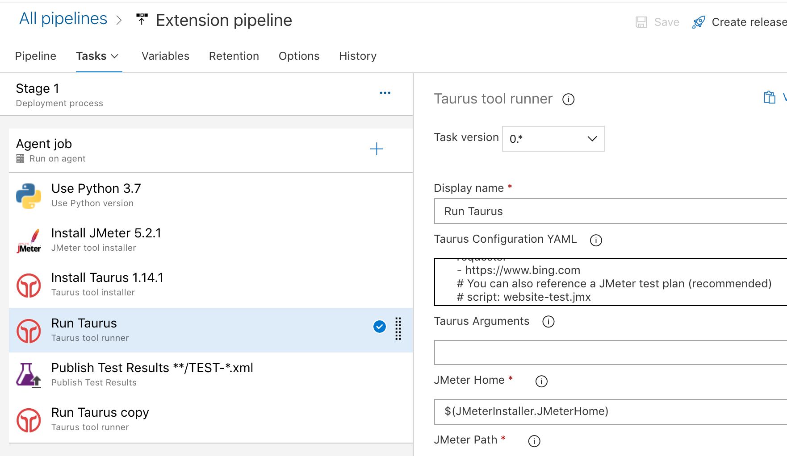

## JMeter extension for Azure pipelines

This extension provides the following components:
- A JMeterInstaller task that installs JMeter along with a flexible collection of plugins
- A TaurusInstaller task that installs Taurus on a Python 3.6+ environment
- A TaurusRunner task that can run JMeter or other test plans using Taurus and produces test results and reports

See [overview.md](overview.md) for a usage guide.

