## About JMeter

Apache [JMeter](https://www.jmeter.io/)
is a highly versatile open-source integration testing tool. It is often used as a load testing tool for web applications, but can also be used for functional testing and for testing other types of services, such as databases.

## About Taurus

[Taurus](https://gettaurus.org/) is an open-source automation test framework, that can be used in particular to automate JMeter executions. Taurus can take an existing JMeter plan and define load profile and assertions through simple configuration.
Taurus can export a test report in JUnit format, that can be published to an Azure DevOps pipeline.

## About the JMeter extension

This extension provides the following components:
- A JMeterInstaller task that installs JMeter along with a flexible collection of plugins
- A TaurusInstaller task that installs Taurus on a Python 3.6+ environment
- A TaurusRunner task that can run JMeter or other test plans using Taurus and produces test results and reports

The JMeter tool installer task acquires a specified version of [JMeter](https://www.jmeter.io/) from the Internet or the tools cache and prepends it to the PATH of the Azure Pipelines Agent (hosted or private). This task can be used to change the version of JMeter used in subsequent tasks. Adding this task before the TaurusRunner in a build definition ensures you are using that task with the right JMeter version.

This extension is intended to run on **Windows**, **Linux** and **MacOS** agents.

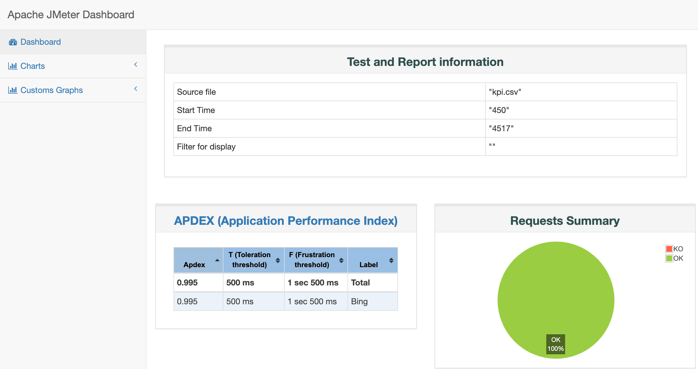

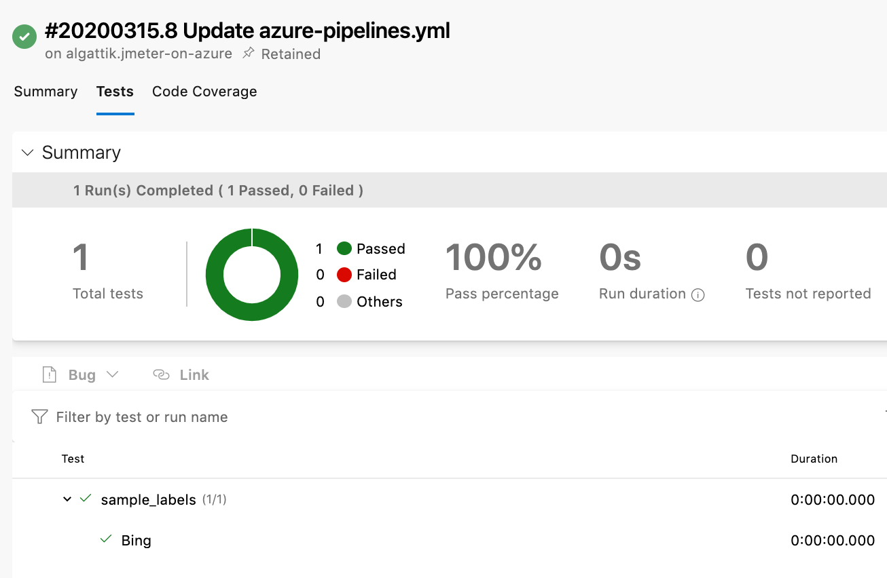

## JMeter tool installer task

- Search for **JMeter tool installer** and click on **Add**

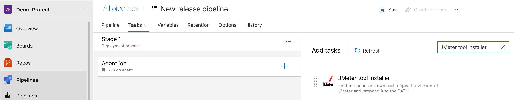

- In the **Version** input, select the exact version of JMeter you want to install on the build agent. e.g. if you want to install version 5.1, enter `5.1`

- In the **Plugins** input, optionally enter a comma-separated list of [JMeter plugins](https://jmeter-plugins.org/) to install

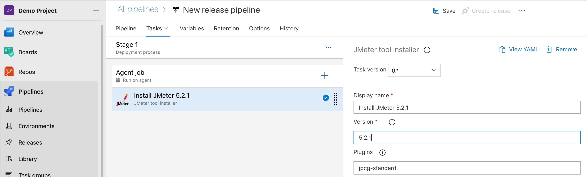

## Taurus tool installer task

- Ensure you have Python 3.6, 3.7 or 3.8 installed. Search for **Use Python version** and click on **Add**. Under `Version spec`, enter `3.8`. *Python 3.9 is [reported not to work](https://github.com/algattik/azure-pipelines-jmeter-extension/issues/8).*

- Search for **Taurus tool installer** and click on **Add**

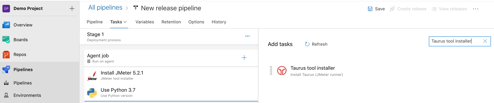

- In the **Version** input, select the exact version of Taurus you want to install on the build agent. e.g. if you want to install version 1.14.0, enter `1.14.0`

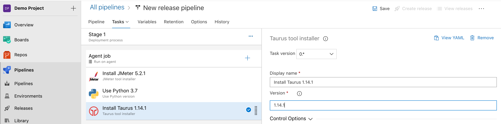

## Taurus tool runner task

- Search for **Taurus tool runner** and click on **Add**

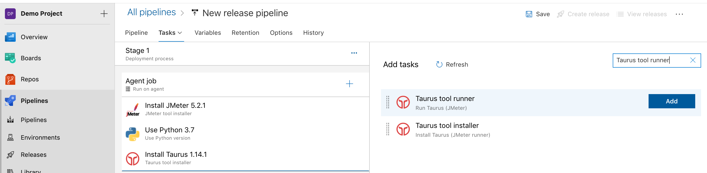

* In the **Taurus Arguments** enter a space-separated list of files or websites to test. The following arguments can be passed:
  * Taurus YAML definition file (recommended), which can reference a JMeter JMX file. Example:

        execution:
        - scenario:
            script: website-test.jmx
          concurrency: 5
          hold-for: 10s
          ramp-up: 2s
        reporting:
        - module: junit-xml
          filename: TEST-Taurus.xml

  * A JMeter JMX file. This is equivalent to the following YAML file:

        execution:
        - scenario:
            script: my-file.jmx

  * A URL to test, for quick load testing.
  * Extra options and arguments to the `bzt` command line. For example, you can pass `-o modules.jmeter.properties.KEY=VALUE` to inject a property via a placeholder `${__P(KEY)}` in a JMeter plan.

* Leave the **JMeter Home**,  **JMeter Path** and **JMeter Version** fields to their default value, to use the version of JMeter installed by the JMeter Installer task.

* The **Artifacts output directory** will contain a `report` directory with an HTML report.

* Enter a value in the **Report name** field to generate an HTML report. The report will be available as a build artifact in a build pipeline, or in the build logs in a release pipeline:

    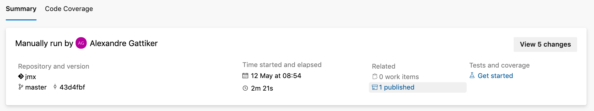

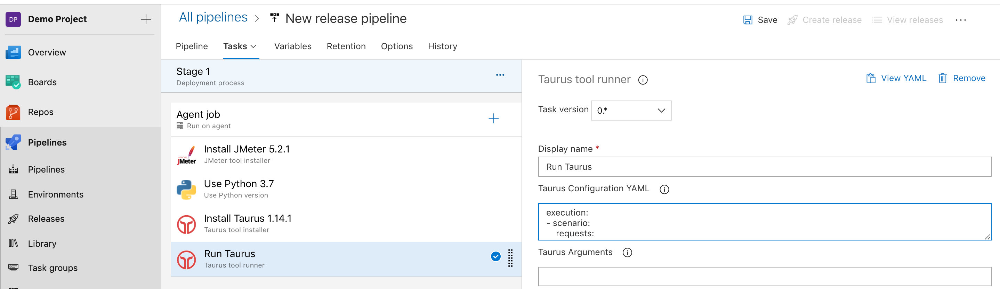

## Advanced usage

### Setting JMeter properties

Check the [Taurus JMeter documentation](https://gettaurus.org/docs/JMeter/) for how to control the JMeter execution in detail.

JMeter properties can be set in the YAML file, or as arguments as a JSON structure. For example, to change the granularity of report time graphs from the default of 60000 ms, use the following argument to the Taurus tool runner task:

    -o modules.jmeter.properties="{'jmeter.reportgenerator.overall_granularity':1000}"

### Real-time test monitoring with Azure Application Insights

You can follow your test progress using real-time dashboards using the [Application Insights](https://docs.microsoft.com/en-us/azure/azure-monitor/app/app-insights-overview) managed service.

* In your local JMeter installation, configure the [Plugins Manager](https://www.blazemeter.com/blog/how-install-jmeter-plugins-manager/) and install the [Azure backend listener](https://github.com/adrianmo/jmeter-backend-azure) plugin to send live data to Application Insights.

* In your JMeter test plan, add a Backend Listener using the Azure listener and the instrumentation key
placeholder `${__P(INSTRUMENTATION_KEY)}`.

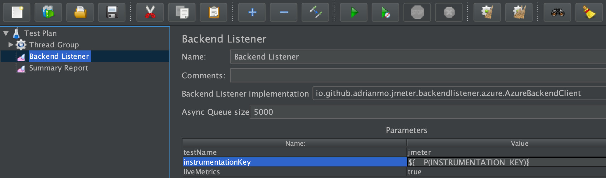

* In your pipeline, in the **JMeter tool installer** task, under **plugins**, enter `jmeter.backendlistener.azure` in order to
install the plugin on the build agent as well.

* [Create an Azure Application Insights resource](https://docs.microsoft.com/azure/azure-monitor/app/create-new-resource) and copy the Instrumentation Key.

* In your pipeline, as argument to the Taurus Runner task, enter:

```
-o modules.jmeter.properties.INSTRUMENTATION_KEY="<your key>" your-test-file.jmx
```

When running your test, you can follow the run outcomes in the Application Insights resource in the Azure portal:

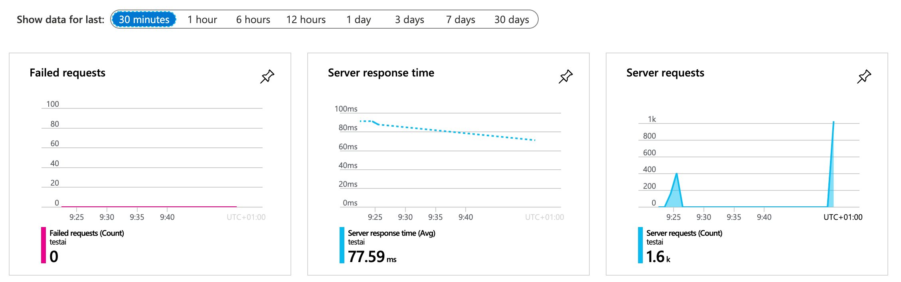

You can see test data in real time in the Live Metrics view. Note that the view is available only while the test is running.

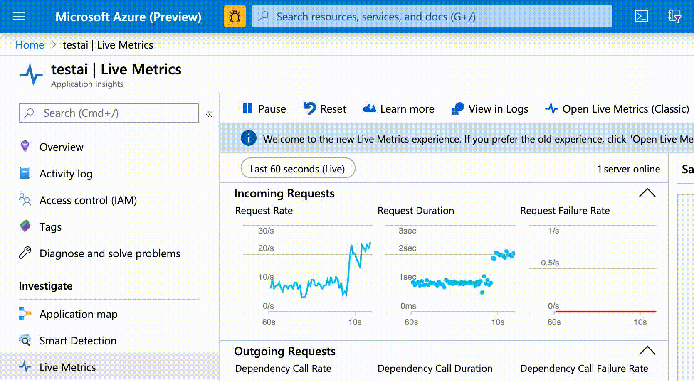

You can also dig into the logs (`requests` collection) and generate charts and dashboards:

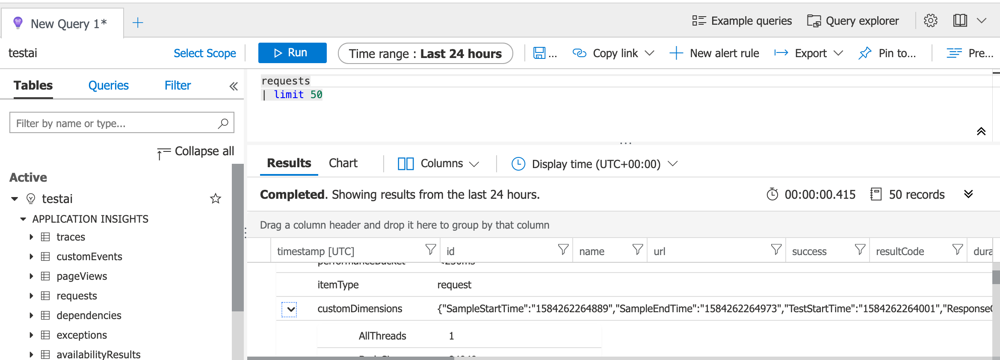

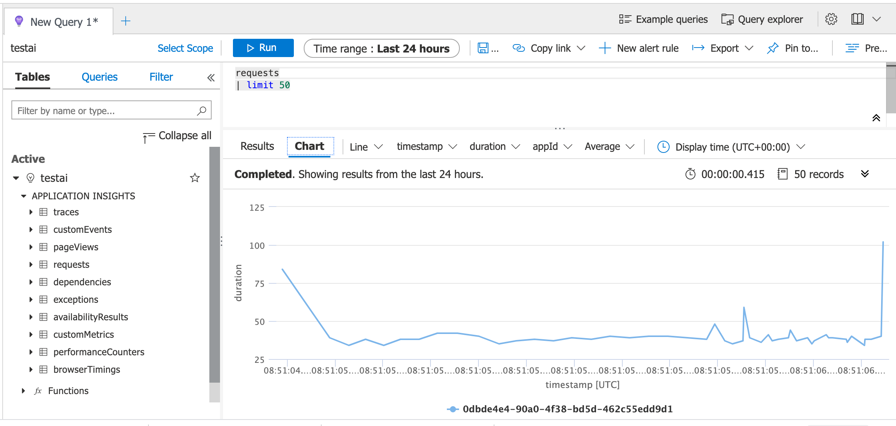

### Using custom Java libraries

You can extend the JMeter classpath to use additional libraries. This example walks through setting up a Sampler
that sends requests to a Kafka endpoint (for example, an [Azure Event Hubs](https://docs.microsoft.com/en-us/azure/event-hubs/event-hubs-for-kafka-ecosystem-overview) instance).

* In your code repository, create a file `kafka-clients-uber-jar.xml` with the following content:

```
<?xml version="1.0"?>
<project xmlns="http://maven.apache.org/POM/4.0.0" xmlns:xsi="http://www.w3.org/2001/XMLSchema-instance" xsi:schemaLocation="http://maven.apache.org/POM/4.0.0 http://maven.apache.org/xsd/maven-4.0.0.xsd">
  <modelVersion>4.0.0</modelVersion>
  <groupId>com.example</groupId>
  <artifactId>kafka-clients-uber-jar</artifactId>
  <version>0.0.1</version>
  <dependencies>
    <dependency>
      <groupId>org.apache.kafka</groupId>
      <artifactId>kafka-clients</artifactId>
      <version>2.3.1</version>
    </dependency>
  </dependencies>
  <build>
    <plugins>
      <plugin>
        <groupId>org.apache.maven.plugins</groupId>
        <artifactId>maven-shade-plugin</artifactId>
        <version>3.2.2</version>
        <configuration>
          <createDependencyReducedPom>false</createDependencyReducedPom>
        </configuration>
        <executions>
          <execution>
            <phase>package</phase>
            <goals>
              <goal>shade</goal>
            </goals>
          </execution>
        </executions>
      </plugin>
    </plugins>
  </build>
</project>
```

This is a Maven POM file that only serves to collect the `org.apache.kafka:kafka-clients` Maven JAR and all its dependencies
into a single "shaded" JAR, that we will put in the classpath of our job run.

* In your pipeline, configure a [Maven task](https://docs.microsoft.com/en-us/azure/devops/pipelines/tasks/build/maven?view=azure-devops) to run the `package` goal on your `kafka-clients-uber-jar.xml` POM file.

* Create a JMeter test plan with custom code to connect to Kafka. The easiest way is to create a JSR223 Sampler and write Groovy
code.

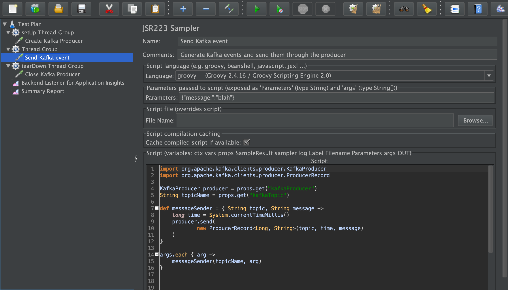

* In your code repository, create a file `kafka-test.yml` with the following content:

```
execution:
- scenario:
    script: kafka-test.jmx
    properties:
      user.classpath: target/kafka-clients-uber-jar-0.0.1.jar
  concurrency: 5
  iterations: 2000
```

Ensure that the `user.classpath` points to the location where the Maven task builds the target JAR.

* In your pipeline, configure the JMeter Installer task, the Taurus Installer task, and the Taurus Runner task. As argument to 
the Taurus Runner task, enter the location of your `kafka-test.yml` file.

### Distributed testing

Running JMeter in distributed mode ([Remote Testing](https://jmeter.apache.org/usermanual/remote-test.html)) requires bidirectional communication between server and client instances. Therefore, it can only be used with [self-hosted agents](https://docs.microsoft.com/en-us/azure/devops/pipelines/agents/agents?view=azure-devops&tabs=browser#install). You could run JMeter servers on Virtual Machines or Azure Container Instances on the same virtual network as the hosted agent.

For instance, [deploy an Azure Container Instance](https://portal.azure.com/#create/Microsoft.ContainerInstances) in the Azure portal.  Use the `justb4/jmeter:5.1.1` Docker image for JMeter from Docker Hub. Under Networking, place your instance in a new subnet in your VNET. In Advanced settings, use command override and enter command `["/entrypoint.sh", "-s", "-Jserver.rmi.ssl.disable=true" ]`.

Run JMeter from the command line with the [`-R` flag](https://jmeter.apache.org/usermanual/remote-test.html):

```
jmeter -n -Jserver.rmi.ssl.disable=true -t website-test.jmx -R CONTAINER_INSTANCE_IP_ADDRESS
```

or use the Taurus runner to run [JMeter in distributed mode](https://gettaurus.org/docs/JMeter/#Run-JMeter-in-Distributed-Mode):

```
execution:
- distributed:
  - <CONTAINER_INSTANCE_IP_ADDRESS>
  scenario: test_website
scenarios:
 test_website:
   properties:
     loops: 10
     threads: 2
     rampup: 10
     server.rmi.ssl.disable: true
   requests:
   - https://www.bing.com
```

For a more complete solution template, see the [JMeter and Terraform Azure sample](https://github.com/Azure-Samples/jmeter-aci-terraform) on GitHub.
